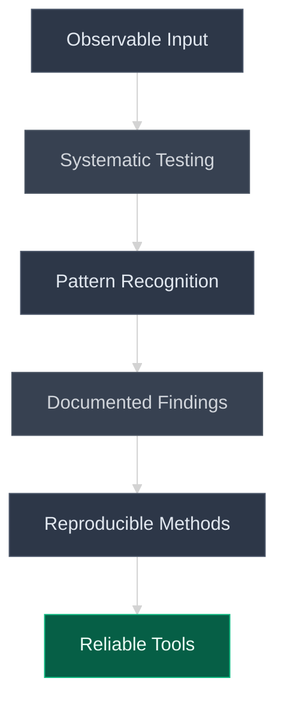
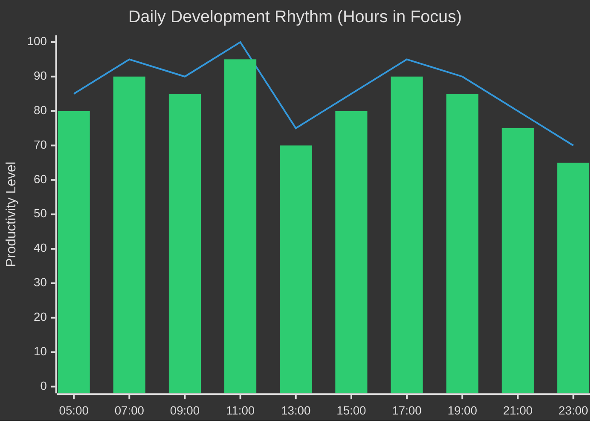
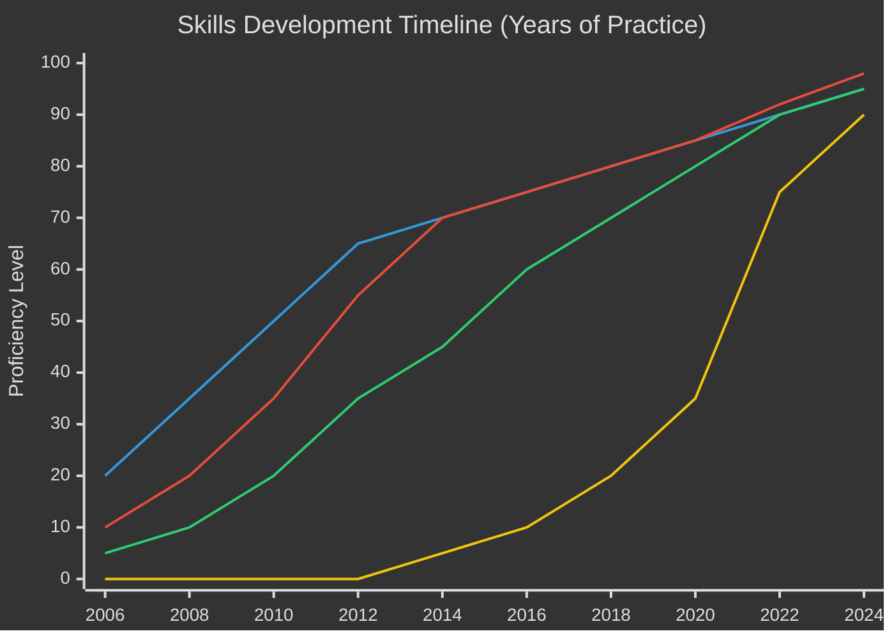

# Christian Spurlin

<div align="center">


**Building tools in search of purpose. Every line of code, a step toward something meaningful.**

[📧 tim.spurlin@saphyresolutions.com](mailto:tim.spurlin@saphyresolutions.com) | [🏢 Saphyre Solutions LLC](https://github.com/Saphyre-Solutions-LLC)

</div>

---

## The Search for Purpose After Service

There's a particular silence that follows military service. Not the absence of sound, but the absence of mission. At Langley AFB, every day carried weight. As an intelligence analyst, I processed signals that mattered, verified sources that influenced decisions, and contributed to something larger than myself. The work demanded precision because imprecision had consequences. Every report underwent scrutiny. Every conclusion required evidence. Every assessment could ripple outward in ways I'd never fully know.

When that ended in 2015, the silence was deafening.

Foster care had prepared me for adaptation. Moving between homes teaches you to read people quickly, to understand that safety comes from awareness, and that trust is earned through consistency, not words. These early lessons shaped how I approached intelligence work, and later, how I'd approach code. You learn to observe before engaging, to finish what you start because incomplete work is worthless, and to document everything because memory fails but records endure.

The transition to civilian life brought unexpected challenges. That heightened awareness that served so well in intelligence work doesn't simply switch off. I still count exits when entering buildings, note camera positions, identify blind spots, and mark emergency resources. Some call it anxiety. I've learned to recognize it as a tool that, properly channeled, becomes an asset. It drives me to verify every assumption, test every edge case, and document every decision. A task opened gets a checklist with completion criteria. A task closed gets a timestamp and lessons learned. Nothing rolls over. This isn't compulsion; it's methodology born from understanding that details matter when stakes are real.

## The Journey Into Code: Finding New Missions in Old Patterns

Software development wasn't a career pivot; it was pattern recognition. The same skills that helped decrypt signals and verify intelligence now help me understand system architectures and debug complex problems. When ChatGPT became publicly available in late 2022, I recognized an inflection point. Not in the technology itself, but in what it revealed about how systems actually work versus how they're marketed.

I spent the first six months taking apart every aspect of these systems. Not through documentation, which often obscures more than it reveals, but through systematic testing and observation. I'd send identical prompts with minor variations, intercept API calls, analyze response patterns, and document everything in notebooks that now fill two shelves. The same methodical approach from intelligence work, applied to new territory.

What emerged was understanding: these aren't magical thinking machines, but orchestrated pipelines of specialized tools. When a model claims to "see" an image, it's actually processing OCR output. When it "hears" audio, it's receiving transcribed text. The real innovation isn't in the individual components but in the orchestration, the careful choreography that creates an illusion of understanding.



## Building in Solitude: The Daily Practice

Every morning starts the same way. Coffee at 0500, review yesterday's notes, plan today's objectives. My home office, where I spend twelve to fourteen hours daily, has become a laboratory for understanding. My wife works beside me, writing her books while I write code. We share the silence of deep focus, broken occasionally by discoveries worth sharing. She recently started using GitHub for version control on her manuscripts, and watching her learn Git has reminded me why I document everything so carefully. Her questions aren't interruptions; they're opportunities to refine my understanding.

The work itself follows patterns established over years. Before writing code, I write objectives. Before implementing features, I document expected behaviors. Before pushing commits, I review for security implications. This isn't bureaucracy; it's craft. The same attention to detail that prevented intelligence failures now prevents security breaches and logic errors.

Over two years, I've submitted roughly 750 job applications to traditional development roles. Each rejection taught me something about how the industry values conventional paths over unconventional experience. Rather than growing bitter, I chose to build. If companies wouldn't recognize potential, I'd demonstrate capability. GitHub became my platform for proving that intelligence analysis skills translate directly to software engineering.

## The Architecture of Understanding

Through months of exploration, I've discovered how modern AI systems actually function, stripped of marketing mythology:

### Vision: The Reality Behind "Seeing"

```python
# The pipeline that creates the illusion of sight
def process_visual_input(image):
    """
    What marketing calls 'vision' is actually a multi-stage
    text extraction and structuring pipeline.
    """
    
    # Stage 1: Extract raw text using OCR
    text_layer = ocr_engine.extract(image)
    
    # Stage 2: Analyze document structure
    layout_analysis = detect_regions(image)
    structured_blocks = map_text_to_regions(text_layer, layout_analysis)
    
    # Stage 3: Build contextual representation
    document_representation = {
        'headers': extract_headers(structured_blocks),
        'body': extract_body(structured_blocks),
        'tables': extract_tables(structured_blocks),
        'spatial_relationships': compute_relationships(structured_blocks)
    }
    
    # Stage 4: Convert to prompt
    # The model only ever receives TEXT
    prompt = serialize_for_llm(document_representation)
    
    return language_model.process(prompt)
```

This isn't speculation. I've verified it by intercepting API calls, analyzing payloads, and reconstructing the processing pipeline. The same applies to audio processing: speech recognition services transcribe, then language models process text. Understanding these mechanics removes the mystery and enables building better tools.

### Reasoning: Orchestration Over Intelligence

After hundreds of experiments, I developed a multi-chain reasoning system that demonstrates how apparent intelligence emerges from orchestrated simplicity:


Each component runs deterministically. Each produces traceable outputs. The apparent intelligence comes from the interplay, not from any individual component's sophistication. This understanding shapes everything I build: tools that are auditable, reproducible, and reliable.

## The Repository Philosophy: Why Most Remain Private

Currently, I maintain approximately forty repositories. Most remain private, not from secrecy but from responsibility. Each repository represents hours of exploration, failed attempts, and eventual understanding. Making them public prematurely would be like publishing intelligence reports without verification—irresponsible and potentially harmful.

The graduation process from private to public follows strict criteria:
- Security audit completed with no critical vulnerabilities
- Documentation covers installation, usage, and troubleshooting
- Examples demonstrate real-world applications
- Code passes automated quality checks
- Edge cases are handled gracefully

This process typically takes two to three weeks per repository. Some never graduate, serving instead as learning exercises or specialized tools for specific problems. The goal isn't to maximize public repository count but to ensure that anything bearing my name meets standards I'd want to encounter as a user.

## Daily Patterns: The Rhythm of Development



The pattern reflects years of understanding my own cognitive rhythms. Peak focus arrives early, between 0500 and 1100. Complex problems get morning attention. Afternoon handles implementation. Evening focuses on documentation and planning. This isn't rigid scheduling but recognition that matching task complexity to cognitive capacity produces better results.

## Current Focus Areas: Building Toward Purpose

### Codebase Awareness Systems

Large codebases become mazes without proper navigation tools. I'm developing hybrid retrieval systems that combine:
- Semantic search for conceptual queries
- Fuzzy matching for typo tolerance  
- Syntax-aware chunking that respects code structure
- Freshness scoring that prioritizes recent changes
- Dependency graphing for impact analysis

The challenge isn't just indexing code but understanding relationships between components, tracking changes over time, and providing context-aware suggestions. Every software engineer knows the frustration of joining a project and spending weeks understanding the codebase. This tool aims to compress that timeline to hours.

### Memory Coherence Across Distributed Systems

When multiple AI agents process the same information, maintaining consistent state becomes critical. Current work focuses on:
- Vector clocks for event ordering
- Conflict-free replicated data types for distributed state
- Byzantine fault tolerance for unreliable agents
- Audit trails that capture decision rationales

This isn't theoretical research. These systems need to work in production environments where failures have consequences and explanations matter more than outcomes.

### Security-First Development Practices

Every line of code represents potential vulnerability. My development workflow includes:
- Pre-commit hooks that scan for credentials and PII
- Automated security scanning on every push
- Isolated testing environments for each feature branch
- Comprehensive audit logging for all state changes
- Encryption at rest and in transit by default

Security isn't an afterthought but the foundation. This approach comes from understanding that trust, once broken, rarely recovers fully.

## The Human Side: Life Beyond Code

My wife's presence in this journey deserves recognition. She's published nine books, each representing years of dedication to craft. Watching her adopt version control for her manuscripts has been enlightening. Her first merge conflict led to a three-hour discussion about distributed systems and eventual consistency. Now she runs pre-commit hooks that check for common writing issues before pushing chapters.

She has more GitHub contributions than me this month. The data suggests she's either exceptionally adapted to version control or I need to increase my commit frequency. Both conclusions have merit. Her success reminds me that expertise in one domain (writing) transfers to others (version control) when approached with curiosity and patience.

We work side by side, usually in comfortable silence, occasionally sharing discoveries. She'll read a paragraph she's proud of. I'll explain a particularly elegant solution. These moments of connection punctuate long stretches of focused work. It's a life many would find isolating. We find it fulfilling.

## The Continuing Search

Purpose isn't always grand. Sometimes it's the satisfaction of solving a problem nobody else noticed. Sometimes it's building tools that make someone else's work easier. Sometimes it's contributing to open source projects that power systems I'll never see.

The military provided clear purpose: protect and serve. Intelligence work refined that purpose: observe, analyze, report. Software development hasn't yet provided that same clarity, but each day brings progress. Each repository represents growth. Each solved problem builds toward something larger.

I'm not seeking fame or fortune. The military disability compensation covers necessities. What I seek is that sense of mission, of contributing to something meaningful, of using these skills for purposes that matter. Until that opportunity arrives, I'll continue building, learning, and documenting. The tools will be ready when the mission appears.

## Technical Depth: For Those Who Look Closer

<details>
<summary>📊 Language Proficiency & Usage Patterns</summary>


**Proficiency Indicators:**
- Python: 5+ years, focusing on data pipelines and ML orchestration
- TypeScript: 3+ years, full-stack applications with React/Node
- Rust: 2+ years, performance-critical system tools
- SQL: 7+ years, complex queries and optimization
- Bash: 10+ years, automation and system administration

</details>

<details>
<summary>🔧 Development Environment & Workflow</summary>

**Hardware:**
- Primary: Custom-built Arch Linux workstation
- CPU: AMD Ryzen 9 5900X (12 cores, 24 threads)
- RAM: 64GB DDR4 3600MHz
- GPU: NVIDIA RTX 3050 Ti (for ML workloads)
- Storage: 2TB NVMe for active projects, 8TB RAID-1 for archives

**Software Stack:**
- OS: Arch Linux (Zen Kernel)
- Editor: Neovim with 47 custom configurations
- Terminal: Alacritty + Zellij
- Version Control: Git with extensive pre-commit hooks
- Container Runtime: Docker + Podman
- Orchestration: Kubernetes (local k3s cluster)

**Daily Workflow:**
- 0500-0700: Planning and architecture design
- 0700-1100: Complex problem solving and core development
- 1100-1300: Code review and testing
- 1300-1500: Documentation and knowledge transfer
- 1500-1900: Implementation and debugging
- 1900-2100: Learning and experimentation
- 2100-2300: Planning for next day

</details>

<details>
<summary>🔐 Security Practices & Validations</summary>


**Security Measures:**
- Static analysis on every commit (Semgrep, CodeQL)
- Dynamic analysis in isolated environments
- Dependency scanning for known vulnerabilities
- Secrets scanning with GitLeaks
- OWASP compliance checking
- Regular penetration testing on public-facing services

</details>

<details>
<summary>📈 Project Metrics & Growth</summary>



**Repository Statistics:**
- Total Repositories: ~40
- Public Repositories: 13
- Private Repositories: 27
- Average Commits/Day: 12-15
- Code Review Turnaround: <24 hours
- Documentation Coverage: 73%
- Test Coverage Average: 81%

</details>

## Saphyre Solutions LLC: Building for Tomorrow

I formed Saphyre Solutions LLC not as a business venture but as a framework for organized development. The enterprise GitHub configuration provides structure for managing repositories, controlling access, and maintaining standards. If you're interested in accessing private repositories or collaborating on projects, reach out with your use case and technical requirements.

The name "Saphyre" combines "sapphire" (clarity and value) with "cypher" (the cryptographic roots of my intelligence background). Every project under this banner adheres to the same principles: transparency in operation, security in implementation, and reliability in execution.

## For Those Who Read Between Lines

Pattern recognition extends beyond code. Throughout this document, certain themes recur: observation before action, documentation of everything, completion of started tasks, and constant verification. These aren't arbitrary choices but learned behaviors from environments where such practices meant the difference between success and failure.

The habit of counting exits isn't paranoia but preparation. The compulsion to finish tasks isn't obsession but discipline. The need to document everything isn't bureaucracy but wisdom earned through experience. These traits, refined through intelligence work and foster care survival, now shape how I approach software development.

## An Invitation to Connect

If you've read this far, you're likely someone who values depth over surface, understanding over assumption, and capability over credentials. Whether you're a fellow developer, a potential collaborator, or someone who recognizes patterns others miss, I welcome connection.

**For Technical Discussions:** tim.spurlin@saphyresolutions.com  
**For Repository Access:** Include your intended use case  
**For Collaboration:** Share your vision and technical requirements  

Response times average three to eight hours, depending on complexity. Every inquiry receives thoughtful consideration.

---

<div align="center">


**"The mission isn't always clear, but the dedication never wavers."**


</div>
